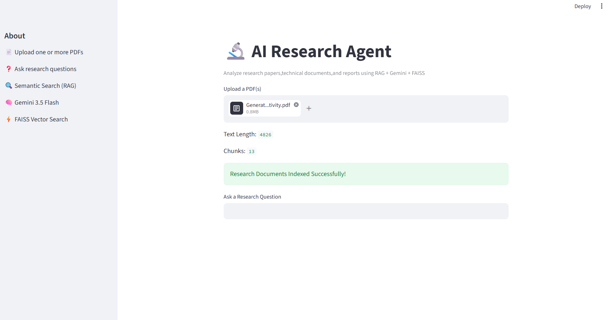
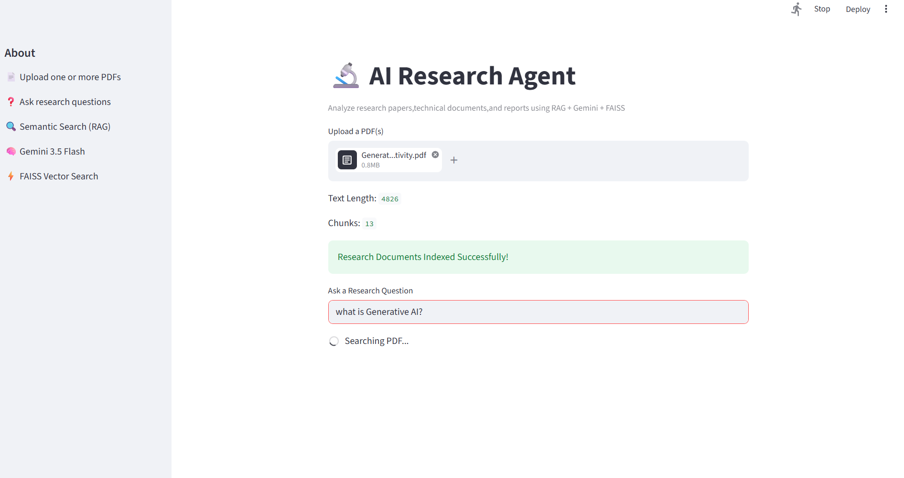
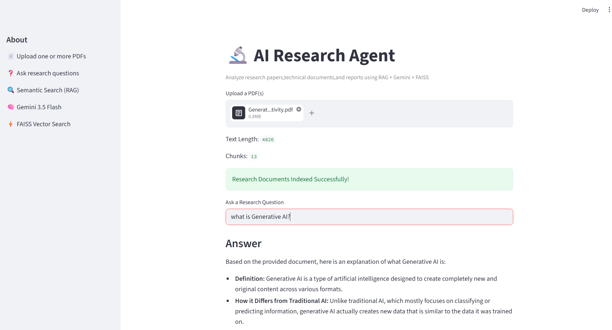
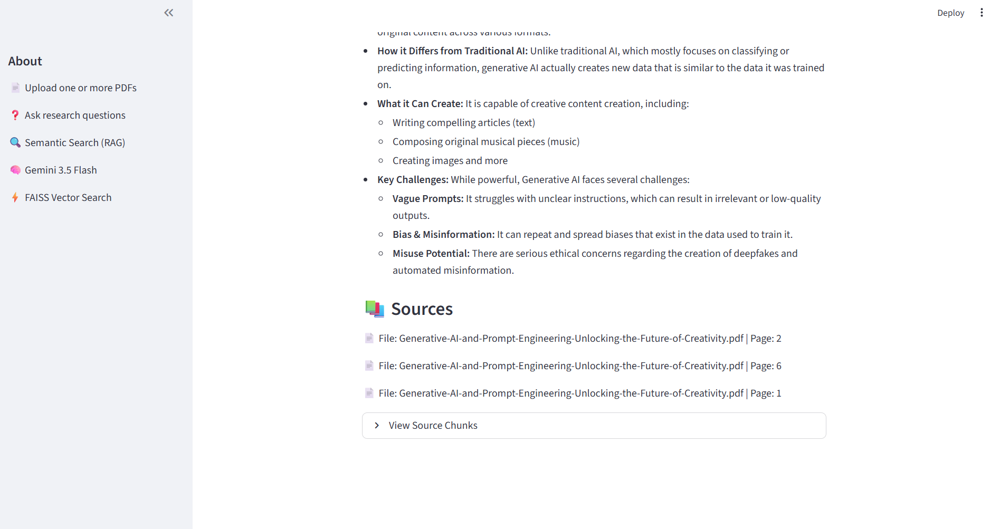

# 🤖 AI Research Agent

An AI-powered research assistant that enables users to upload one or more PDF documents and ask questions in natural language. The application uses **Retrieval-Augmented Generation (RAG)**, **FAISS Vector Search**, **Sentence Transformers**, and **Google Gemini 3.5 Flash** to generate context-aware answers with source citations.

---

## Features

- 📄 Upload one or multiple PDF documents
- 🔍 Semantic search using FAISS
- 🧠 Retrieval-Augmented Generation (RAG)
- 🤖 AI-powered question answering with Gemini
- 📚 Citation-supported responses
- 📑 Displays source document and page number
- ⚡ Fast vector-based document retrieval

---

## Tech Stack

- Python
- Streamlit
- Google Gemini 3.5 Flash
- FAISS
- Sentence Transformers
- PyPDF
- LangChain Text Splitter
- python-dotenv

---

## Project Structure

```text
AI_RESEARCH_AGENT/
│── screenshots/
│   ├── 01_Home_Page.png
│   ├── 02_PDF_Upload.png
│   ├── 03_Document_Indexed.png
│   ├── 04_Question_Input.png
│   ├── 05_Generated_Answer.png
│   └── 06_Answer_With_Sources.png
│── main.py
│── requirements.txt
│── .env
│── README.md
```

---

## Installation

### Install dependencies

```bash
pip install -r requirements.txt
```

### Configure API Key

Create a `.env` file:

```env
GEMINI_API_KEY=YOUR_API_KEY
```

### Run the application

```bash
streamlit run main.py
```

---

## Workflow

1. Upload one or more PDF documents.
2. Extract and split document text into chunks.
3. Generate embeddings using Sentence Transformers.
4. Store embeddings in FAISS.
5. Retrieve relevant document chunks based on the user's query.
6. Generate a context-aware answer using Google Gemini.
7. Display the answer with source citations.

---

## Screenshots

### Home Page


### Upload PDF


### Document Indexed


### Enter Question


### Generated Answer


### Answer with Sources


## Author

**Elluru Nandini**  
B.Tech – Computer Science & Engineering
